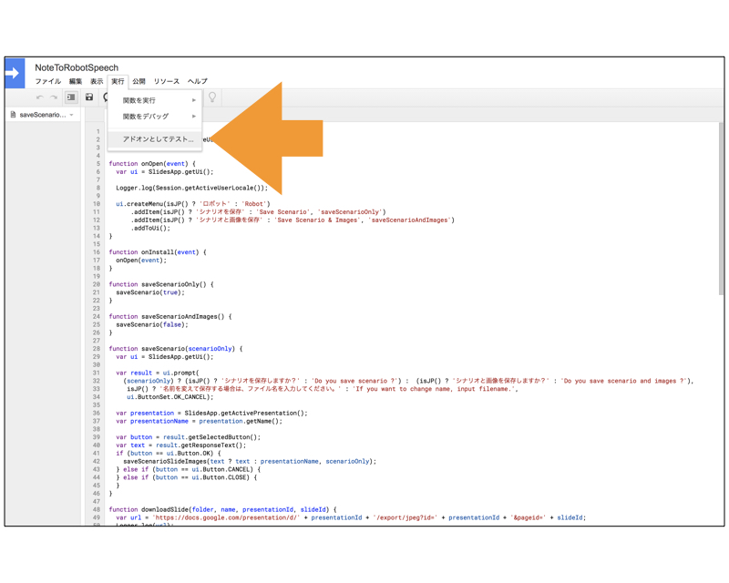
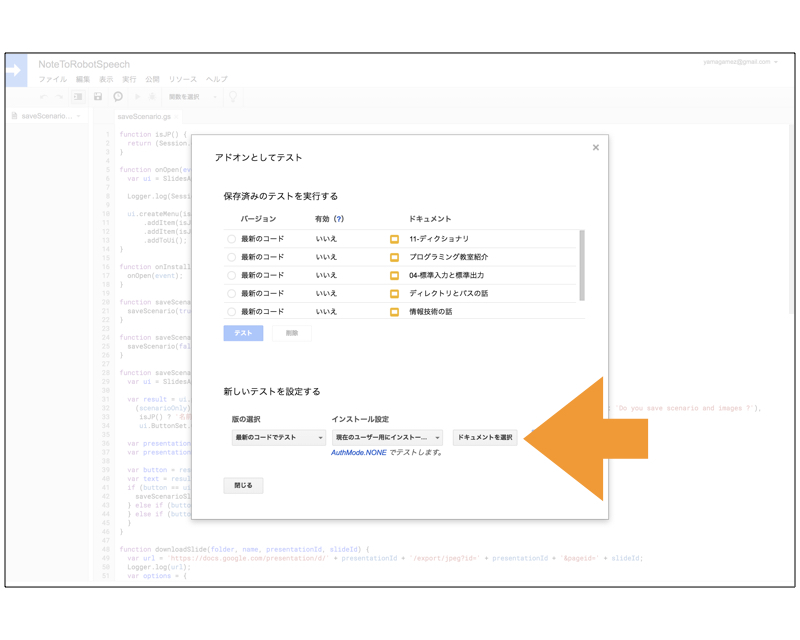
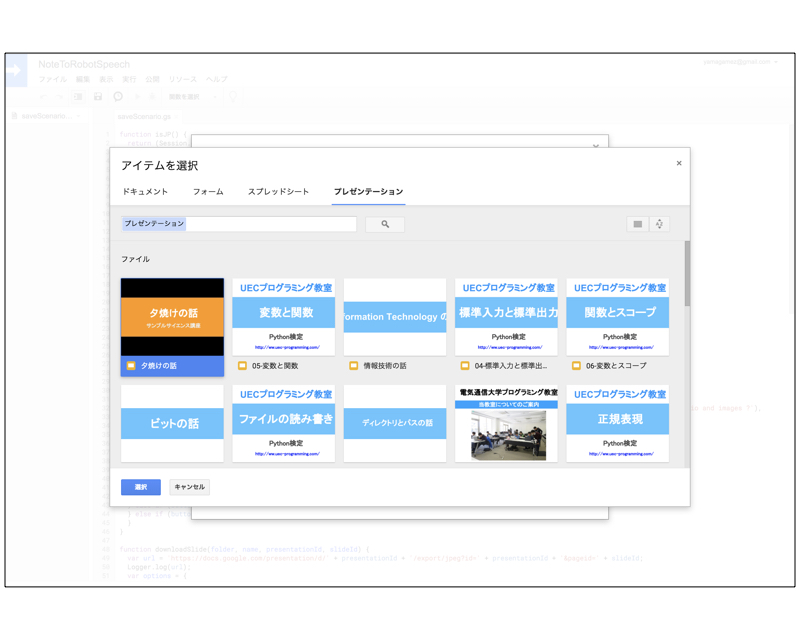
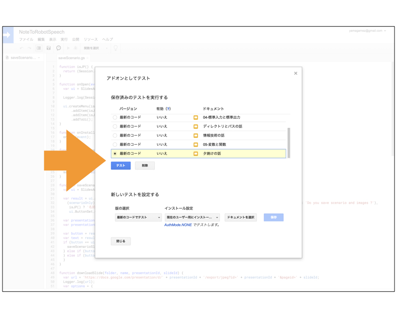
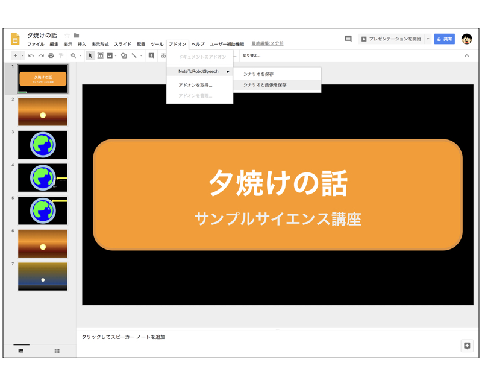
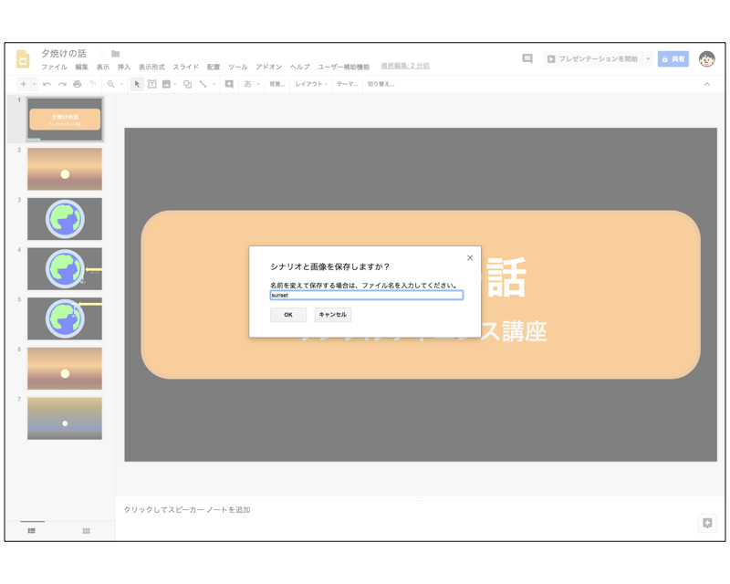
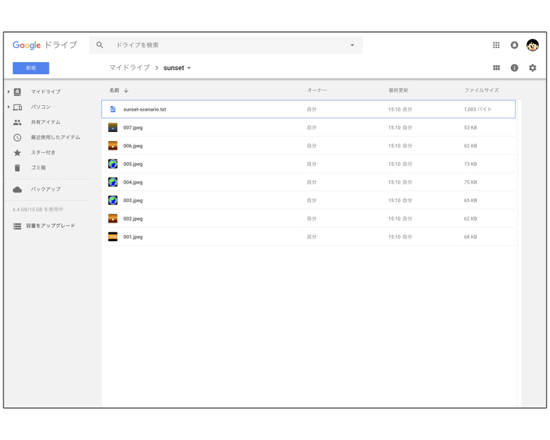
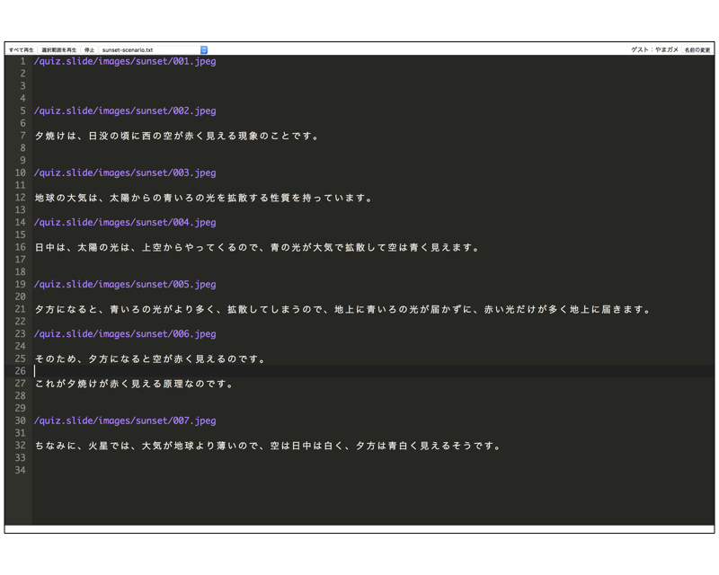

# Dora Script Sample

DoraEngineで動作するサンプルスクリプトです。
動かすにはDoraEngineのロボット一式が必要です。

## 使い方

次のURLをクリックします。Googleにログインしていない人はログインします。

- [https://script.google.com/create](https://script.google.com/create)

コードに　[slide-to-dora.gs](./slide-to-dora.gs) をコピペします。プロジェクトの名前には適当な名前を入力します。

保村してから「アドオンとしてテスト」を選択します。



ドキュメントを選択をクリックします。



抜き出したいスライドを選択します。



保存ボタンをクリックします。
抜き出したいスライドを選択して、テストボタンをクリックします。



スライドのアドオンメニューから、シナリオと画像を保存を選択します。



保存するフォルダのフォルダ名を入力します。



 Google Drive に保存されます。



画像ファイルを以下の場所にコピーして、生成したスクリプトをシナリオエディタにコピーします。

```
/home/pi/Pictures/
```



## License

[MIT](LICENSE)
